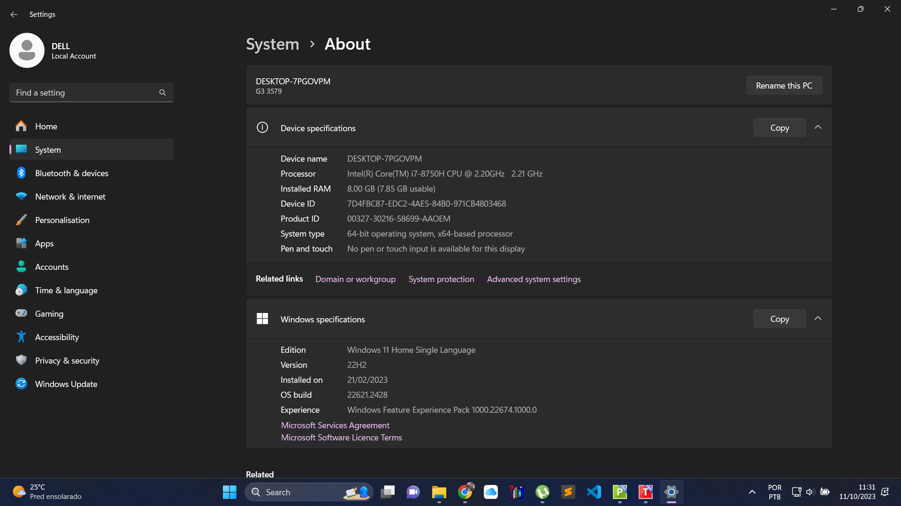

# 📊 Projeto 2: Dashboard de Vendas com Excel (Superstore)


---

## 📋 **Descrição do Projeto**

Este é o **segundo projeto** do meu portfólio de análise de dados. 
O objetivo foi criar um **dashboard interativo no Excel** a partir da base de dados **Superstore**, uma das bases mais famosas para análises de vendas.

O projeto demonstra habilidades em:
- Tratamento e análise de dados no Excel
- Criação de tabelas dinâmicas
- Construção de gráficos profissionais
- Criação de KPIs e cards de métricas
- Versionamento com Git e GitHub

---

## 🖼️ **Preview do Dashboard**



---

## 📁 **Estrutura do Projeto**

dashboard-vendas-superstore/

├── .gitignore # Arquivos ignorados pelo Git
├── README.md # Documentação do projeto
├── superstore_dataset.csv # Base de dados original (10k registros)
├── dashboard_vendas.xlsx # Dashboard final
└── dashboard_print.png # Print do dashboard (visualização)


---

## ✨ **Funcionalidades do Dashboard**

### **KPIs (Cards)**
- ✅ **Total de Vendas:** R$ 2.297.200,86
- ✅ **Total de Lucro:** R$ 43.075,06

### **Gráficos**
- 📊 **Vendas por Categoria** (Gráfico de Colunas)
- 🥧 **Vendas por Região** (Gráfico de Pizza)
- 🏆 **Top 10 Produtos** (Gráfico de Barras)

---

## 🛠️ **Tecnologias Utilizadas**

| Tecnologia | Versão | Aplicação |
|------------|--------|-----------|
| **Excel** | 2016+ | Criação do dashboard, tabelas dinâmicas e gráficos |
| **Git** | 2.x | Controle de versão do projeto |
| **GitHub** | - | Hospedagem do código e documentação |

---

## 🚀 **Como Utilizar**

### Pré-requisitos
- Microsoft Excel 2016 ou superior
- Git (opcional, apenas para clonar)

### Passo a Passo

1. **Clone o repositório**
   ```bash
   git clone https://github.com/mayconaap/dashboard-vendas-superstore.git

2. **Acesse a pasta do projeto**
    cd dashboard-vendas-superstore

3. **Abra o arquivo no Excel**
    Localize o arquivo dashboard_vendas.xlsx
    Clique duas vezes para abrir no Excel

4. **Interaja com o dashboard**
    Veja os KPIs no topo
    Analise os gráficos por categoria, região e produtos
    As tabelas dinâmicas estão na aba "Tabelas_Dinamicas"


### 📊 Base de Dados: Superstore
A base Superstore contém cerca de 10.000 registros de vendas com as seguintes colunas principais:

Coluna	Descrição
Order Date	Data do pedido
Ship Date	Data de envio
Customer Name	Nome do cliente
Segment	Segmento do cliente (Consumer, Corporate, Home Office)
Region	Região (Central, East, South, West)
Category	Categoria (Furniture, Office Supplies, Technology)
Sub-Category	Subcategoria (ex: Chairs, Phones, Tables)
Product Name	Nome do produto
Sales	Valor da venda
Quantity	Quantidade
Discount	Desconto aplicado
Profit	Lucro obtido


### 📈 Insights do Dashboard

**💡 Categoria mais vendida: Technology (R$ 836.154)**

**💡 Região com maior faturamento: West (R$ 725.458)**

**💡 Produto mais vendido: Canon imageCLASS (R$ 20.000+)**

**💡 Lucro total: R$ 43.075,06**


👨‍💻 Autor
Maycon A. P.
https://img.shields.io/badge/GitHub-100000?style=for-the-badge&logo=github&logoColor=white
https://img.shields.io/badge/LinkedIn-0077B5?style=for-the-badge&logo=linkedin&logoColor=white

📝 Licença
MIT © 2025 Maycon A. P.