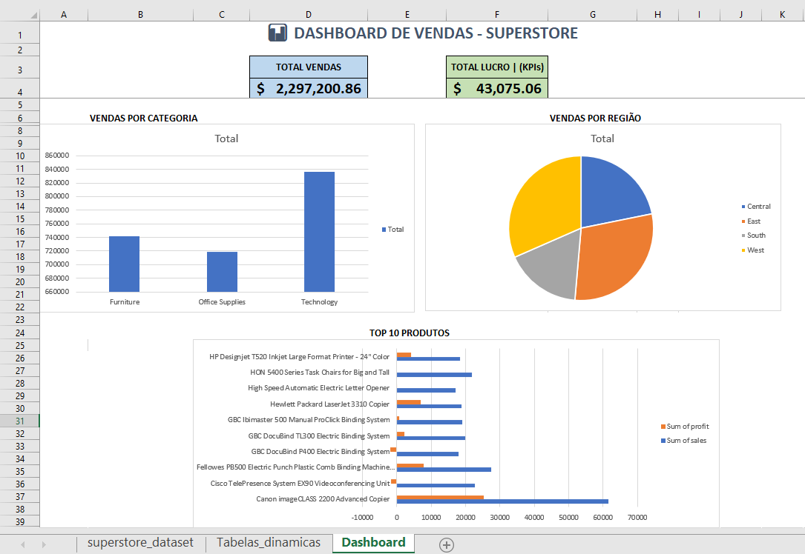

# 📊 Projeto 2: Dashboard de Vendas com Excel (Superstore)

---

## 📋 Descrição do Projeto

Este é o **segundo projeto** do meu portfólio de análise de dados, desenvolvido durante o curso **Santander + DIO**. O objetivo foi criar um **dashboard interativo no Excel** a partir da base de dados **Superstore**.

---

## 🖼️ Preview do Dashboard



---

## 📁 Estrutura do Projeto

- **.gitignore** - Arquivos ignorados pelo Git
- **README.md** - Documentação do projeto
- **superstore_dataset.csv** - Base de dados original (10k registros)
- **dashboard_vendas.xlsx** - Dashboard final
- **dashboard.png** - Print do dashboard

---

## ✨ Funcionalidades do Dashboard

### KPIs (Cards)
- Total de Vendas: R$ 2.297.200,86
- Total de Lucro: R$ 43.075,06

### Gráficos
- Vendas por Categoria (Gráfico de Colunas)
- Vendas por Região (Gráfico de Pizza)
- Top 10 Produtos (Gráfico de Barras)

---

## 🛠️ Tecnologias Utilizadas

- **Excel** - Criação do dashboard, tabelas dinâmicas e gráficos
- **Git** - Controle de versão do projeto
- **GitHub** - Hospedagem do código

---

## 🚀 Como Utilizar

1. **Clone o repositório**
    ```Bash
    git clone https://github.com/mayconaap/dashboard-vendas-superstore.git


2. **Acesse a pasta do projeto**
    ```Bash
    cd dashboard-vendas-superstore


3. **Abra o arquivo no Excel**
- Localize o arquivo `dashboard_vendas.xlsx`
- Clique duas vezes para abrir

4. **Interaja com o dashboard**
- Veja os KPIs no topo
- Analise os gráficos por categoria, região e produtos
- As tabelas dinâmicas estão na aba "Tabelas_Dinamicas"

---

## 📊 Base de Dados: Superstore

A base Superstore contém cerca de 10.000 registros de vendas. Principais colunas:

- **Order Date** - Data do pedido
- **Ship Date** - Data de envio
- **Customer Name** - Nome do cliente
- **Segment** - Segmento do cliente
- **Region** - Região
- **Category** - Categoria do produto
- **Product Name** - Nome do produto
- **Sales** - Valor da venda
- **Profit** - Lucro obtido

---

## 📈 Insights do Dashboard

- **Categoria mais vendida:** Technology (R$ 836.154)
- **Região com maior faturamento:** West (R$ 725.458)
- **Produto mais vendido:** Canon imageCLASS
- **Lucro total:** R$ 43.075,06

---

## 👨‍💻 Autor

**Maycon A. P.**

- GitHub: [github.com/mayconaap](https://github.com/mayconaap)
- LinkedIn: [linkedin.com/in/maycon-pinto](https://www.linkedin.com/in/maycon-pinto/)

---

## 📝 Licença

MIT © 2025 Maycon A. P.